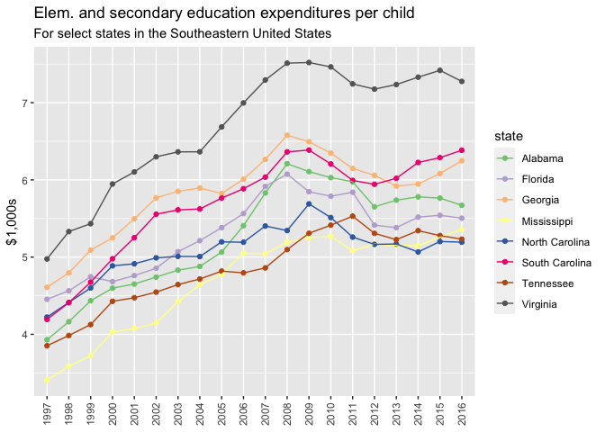

<!-- README.md is generated from README.Rmd. Please edit that file -->

# tidykids

<!-- badges: start -->

<!-- badges: end -->

The not-for-profit organization the [Urban
Institute](https://www.urban.org/) created an incredible dataset on
State-by-State Spending on Kids that is available
[here](https://datacatalog.urban.org/dataset/state-state-spending-kids-dataset).

This data package provides this dataset through R. It is formatted as
[tidy data](https://vita.had.co.nz/papers/tidy-data.pdf) to facilitate
analysis within the [tidyverse](https://www.tidyverse.org/) suite of R
packages.

The data was made available by and is attributable to Julia Isaacs,
Eleanor Lauderback, and Erica Greenberg under the under the ODC
Attribution License (<https://opendatacommons.org/licenses/by/1-0/>).

## Installation

You can install {tidykids} only from GitHub with:

``` r
remotes::install_github("jrosen48/tidykids")
```

## Use

First, load the {tidykids} package:

``` r
library(tidykids)
```

Then, type `tidykids` to load the data:

``` r
tidykids
#> # A tibble: 70,380 x 4
#>    state                variable year     value
#>    <chr>                <chr>    <chr>    <dbl>
#>  1 Alabama              PK12ed   1997   3271969
#>  2 Alaska               PK12ed   1997   1042311
#>  3 Arizona              PK12ed   1997   3388165
#>  4 Arkansas             PK12ed   1997   1960613
#>  5 California           PK12ed   1997  28708364
#>  6 Colorado             PK12ed   1997   3332994
#>  7 Connecticut          PK12ed   1997   4014870
#>  8 Delaware             PK12ed   1997    776825
#>  9 District of Columbia PK12ed   1997    544051
#> 10 Florida              PK12ed   1997  11498394
#> # … with 70,370 more rows
```

To see descriptions of the variables (also available
[here](https://datacatalog.urban.org/sites/default/files/data-dictionary-files/State-by-State%20Spending%20on%20Kids%20Data%20Dictionary%20File_0.xlsx)):

``` r
tidykids_data_dictionary
#> # A tibble: 69 x 5
#>    variable        variable   measurement_unit allowed_values description       
#>    <chr>           <chr>      <chr>            <chr>          <chr>             
#>  1 Elementary and… PK12ed     Numeric          0-             Public spending o…
#>  2 Elementary and… PK12ed_re… Numeric          0-             Public spending o…
#>  3 Elementary and… PK12ed_re… Numeric          0-             Public spending o…
#>  4 Higher educati… highered   Numeric          0-             Public spending o…
#>  5 Higher educati… highered_… Numeric          0-             Public spending o…
#>  6 Higher educati… highered_… Numeric          0-             Public spending o…
#>  7 Education subs… edsubs     Numeric          0-             Public spending o…
#>  8 Education subs… edsubs_re… Numeric          0-             Public spending o…
#>  9 Education subs… edsubs_re… Numeric          0-             Public spending o…
#> 10 Education serv… edservs    Numeric          0-             Public spending o…
#> # … with 59 more rows
```

These are also presented in an easily-readable format in the
[tidykids-codebook vignette](articles/tidykids-codebook.html).

The data can be easily visualized, e.g.:

``` r
library(dplyr, warn.conflicts = FALSE)
library(ggplot2)

tidykids %>% 
    filter(variable %in% c("PK12ed_realperch", "highered_realperch"),
           state %in% c("Tennessee", "Michigan", "North Carolina")) %>% 
    ggplot(aes(x = year, y = value, color = state, group = state)) +
    geom_point() +
    geom_line() +
    theme(axis.text.x = element_text(angle = 90, vjust = 0.5, hjust=1)) +
    facet_wrap(~variable) +
    ggtitle("Elem. and secondary education and higher education expenditures per child")
```


