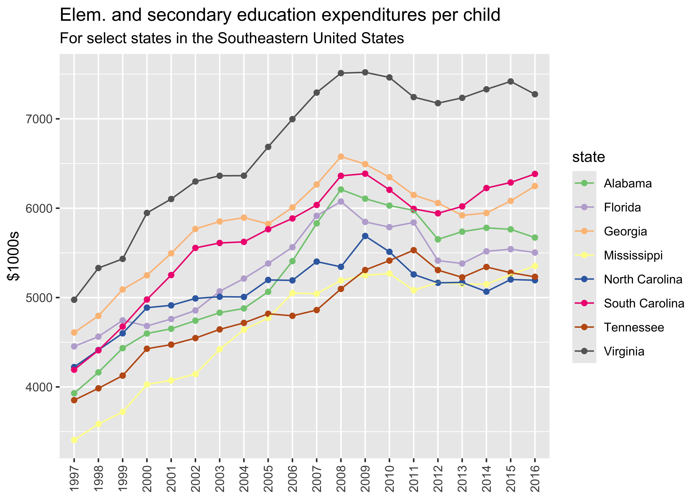

<!-- README.md is generated from README.Rmd. Please edit that file -->

# tidykids

<!-- badges: start -->
<!-- badges: end -->

The not-for-profit organization the [Urban
Institute](https://www.urban.org/) created an incredible dataset on
State-by-State Spending on Kids that is available
[here](https://datacatalog.urban.org/dataset/state-state-spending-kids-dataset).
This data package provides this dataset through R. It is formatted as
[tidy data](https://vita.had.co.nz/papers/tidy-data.pdf) to facilitate
analysis within the [tidyverse](https://www.tidyverse.org/) suite of R
packages.

## Installation

You can install {tidykids} only from GitHub with:

``` r
remotes::install_github("jrosen48/tidykids")
```

## Use

First, load the {tidykids} package:

``` r
library(tidykids)
```

Then, type `tidykids` to load the data:

``` r
tidykids
#> # A tibble: 23,460 × 6
#>    state                variable year       raw   inf_adj inf_adj_perchild
#>    <chr>                <chr>    <chr>    <dbl>     <dbl>            <dbl>
#>  1 Alabama              PK12ed   1997   3271969  4665308.             3.93
#>  2 Alaska               PK12ed   1997   1042311  1486170              7.55
#>  3 Arizona              PK12ed   1997   3388165  4830986.             3.71
#>  4 Arkansas             PK12ed   1997   1960613  2795523              3.89
#>  5 California           PK12ed   1997  28708364 40933568              4.28
#>  6 Colorado             PK12ed   1997   3332994  4752320.             4.38
#>  7 Connecticut          PK12ed   1997   4014870  5724568.             6.70
#>  8 Delaware             PK12ed   1997    776825  1107629.             5.63
#>  9 District of Columbia PK12ed   1997    544051   775730.             6.11
#> 10 Florida              PK12ed   1997  11498394 16394885              4.45
#> # ℹ 23,450 more rows
```

Note that:

- `state` refers to the United States state (including the District of
  Columbia)
- `year` refers to the year
- `raw` refers to the raw amount spent
- `inf_adj` refers to the amount transformed to be in 2016 dollars for
  each year spent
- `inf_adj_per_child` refers to the amount transformed to be in 2016
  dollars for each year per child in \$1000s spent

Detailed descriptions of the variables in the dataset (see the
`variable` column) are available in the [tidykids-codebook
vignette](articles/tidykids-codebook.html).

## Example

The data can prepared for other analyses or be visualized, as below:

``` r
library(dplyr, warn.conflicts = FALSE)
library(ggplot2)

tidykids %>% 
  filter(variable %in% c("PK12ed"),
         state %in% c("Alabama", "Florida", "Georgia", "Mississippi", "North Carolina", "South Carolina", "Tennessee", "Virginia")) %>%
  ggplot(aes(x = year, y = inf_adj_perchild, color = state, group = state)) +
  geom_point() +
  geom_line() +
  theme(axis.text.x = element_text(angle = 90, vjust = 0.5, hjust=1)) +
  scale_color_brewer(type = "qual") +
  xlab(NULL) +
  ylab("$1000s") +
  labs(title = "Elem. and secondary education expenditures per child",
       subtitle = "For select states in the Southeastern United States") 
```



## Shiny

An interactive Shiny web application is available here:
<https://jmichaelrosenberg.shinyapps.io/tidykidsshiny/>

## Attribution

The data was made available by and is attributable to Julia Isaacs,
Eleanor Lauderback, and Erica Greenberg under the under the \[ODC
Attribution License\](<https://opendatacommons.org/licenses/by/1-0/>.
